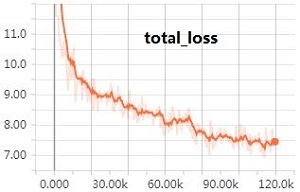
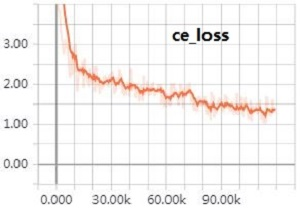
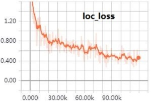
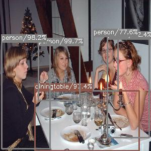
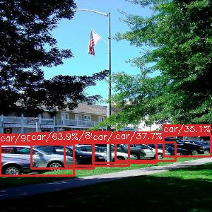
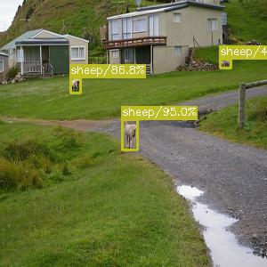

# State-of-the-art Single Shot MultiBox Detector in TensorFlow

This repository contains codes of the reimplementation of [SSD: Single Shot MultiBox Detector](https://arxiv.org/abs/1512.02325) in TensorFlow. If your goal is to reproduce the results in the original paper, please use the official [codes](https://github.com/weiliu89/caffe/tree/ssd).

There are already some TensorFlow based SSD reimplementation codes on GitHub, the main special features of this repo inlcudes:

- state of the art performance(77.8%mAP) when training from VGG-16 pre-trained model (SSD300-VGG16).
- the model is trained using TensorFlow high level API [tf.estimator](https://www.tensorflow.org/api_docs/python/tf/estimator/Estimator). Although TensorFlow provides many APIs, the Estimator API is highly recommended to yield scalable, high-performance models. 
- all codes were writen by TensorFlow ops (no numpy operation) to ensure the performance and portability.
- using ssd augmentation pipeline discribed in the original paper.
- PyTorch-like model definition using high-level [tf.layers](https://www.tensorflow.org/api_docs/python/tf/layers) API for better readability ^-^.
- high degree of modularity to ease futher development.

## ##
## Usage
- Download [Pascal VOC Dataset](https://pjreddie.com/projects/pascal-voc-dataset-mirror/) and reorganize the directory as follows:
	```
	VOCROOT/
		   |->VOC2007/
		   |    |->Annotations/
		   |    |->ImageSets/
		   |    |->...
		   |->VOC2012/
		   |    |->Annotations/
		   |    |->ImageSets/ 
		   |    |->...
		   |->VOC2007TEST/
		   |    |->Annotations/
		   |    |->...
	```
	VOCROOT is your path of the Pascal VOC Dataset.
- Run the following script to generate TFRecords.
	```sh
	python dataset/convert_tfrecords.py --dataset_directory=VOCROOT --output_directory=./dataset/tfrecords
	```
- Download the pre-trained VGG-16 model from [here](https://drive.google.com/drive/folders/184srhbt8_uvLKeWW_Yo8Mc5wTyc0lJT7) and put them into one sub-directory named 'model'.
- Run the following script to start training:

	```sh
	python train_ssd.py 
	```
- Run the following script for evaluation and get mAP:

	```sh
	python eval_ssd.py 
	python voc_eval.py 
	```
	Note: you need first modify some directory in voc_eval.py.
- Run the following script for visualization:
	```sh
	python simple_ssd_demo.py
	```

All the codes was tested under TensorFlow 1.6, Python 3.5, Ubuntu 16.04 with CUDA 8.0. BTW, the codes here had also been tested under TensorFlow 1.4 with CUDA 8.0, but some modifications to the codes are needed to enable replicate model training, take following steps if you need:

- copy all the codes of [this file](https://github.com/tensorflow/tensorflow/blob/v1.6.0/tensorflow/contrib/estimator/python/estimator/replicate_model_fn.py) to your local file named 'tf\_replicate\_model\_fn.py'
- add one more line [here](https://github.com/HiKapok/SSD.TensorFlow/blob/899e08dad48669ca0c444284977e3d7ffa1da5fe/train_ssd.py#L25) to import module 'tf\_replicate\_model\_fn'
- change 'tf.contrib.estimator' in [here](https://github.com/HiKapok/SSD.TensorFlow/blob/899e08dad48669ca0c444284977e3d7ffa1da5fe/train_ssd.py#L383) and [here](https://github.com/HiKapok/SSD.TensorFlow/blob/899e08dad48669ca0c444284977e3d7ffa1da5fe/train_ssd.py#L422) to 'tf\_replicate\_model\_fn'
- now the training process should run perfectly


This repo is just created recently, any contribution will be welcomed.

## Results (VOC07 Metric)

This implementation(SSD300-VGG16) yield **mAP 77.8%** on PASCAL VOC 2007 test dataset(the original performance described in the paper is 77.2%mAP), the details are as follows:

| sofa   | bird  | pottedplant | bus | diningtable | cow | bottle | horse | aeroplane | motorbike
|:-------|:-----:|:-------:|:-------:|:-------:|:-------:|:-------:|:-------:|:-------:|:-------:|
|  79.6  |  76.0 |  52.8   |   85.9  |   76.9    |  83.5 |  49.9  | 86.0  |   82.9    |   81.0   |
| **sheep**  | **train** | **boat**    | **bicycle** | **chair**    | **cat**   | **tvmonitor** | **person** | **car**  | **dog** |
|  81.6  |  86.2 |  71.8   |   84.2  |   60.2    | 87.8 |  76.7  | 80.5  |   85.5   |   86.2   |

You can download the trained model(VOC07+12 Train) from [GoogleDrive](https://drive.google.com/open?id=1yeYcfcOURcZ4DaElEn9C2xY1NymGzG5W) for further research.

Here is the training logs and some detection results:








## ##
Apache License, Version 2.0